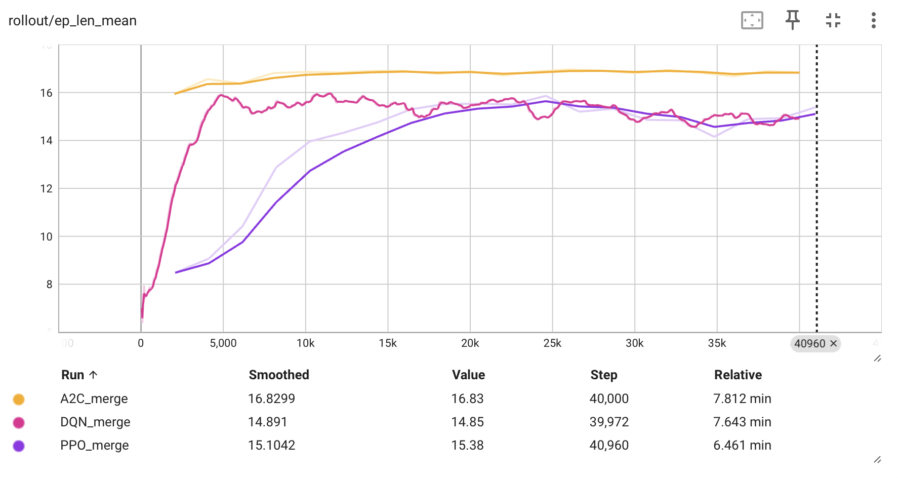
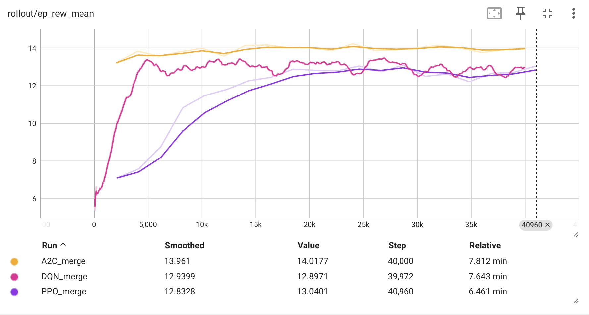

# Evaluation of Deep Reinforcement Learning methods in Autonomous Driving tasks

- [Literature Review: Modern Deep Reinforcement Learning approaches for Autonomous Driving](./pdf/Literature_Review_of_Reinforcement_Learning_for_Autonomous_Driving.pdf);

- [Project Report: Evaluation of Deep Reinforcement Learning methods in Autonomous Driving](./pdf/Project_Report___Reinforcement_Learning_for_Autonomous_Driving.pdf).

---

## Abstract
This project evaluates the effectiveness of three
Deep Reinforcement Learning (DRL) methods, Deep Q-Networks
(DQN), Proximal Policy Optimization (PPO), and Advantage
Actor-Critic (A2C), in addressing autonomous driving challenges.
Using a customizable simulation environment, the agents were
trained and tested across four diverse driving scenarios: highway,
roundabout, merge, and intersection. The analysis focused on both
the training process (e.g., reward progression) and the post-training performance of the models, evaluating metrics such
as total reward, collision rate, and driving behavior realism.
Results showed that PPO generally achieved the best overall
performance in terms of efficiency and realism. However, DQN
delivered results that were often comparable or only slightly
inferior to PPO, demonstrating robustness in various scenarios.
A2C, while effective in some cases, struggled with consistency
and adaptability

## Installation

```bash
pip install -r requirements.txt
```

## Agents' Training

### Highway-V0
Episode Length: <br>


Reward: <br>


Fps:<br>


Entropy Loss:<br>


Explained Variance:<br>


Loss:<br>


Value Loss:<br>


### Roundabout-V0

Episode Length: <br>


Reward: <br>


Fps:<br>


Entropy Loss:<br>


Explained Variance:<br>


Loss:<br>


Value Loss:<br>


### Merge-V0

Episode Length: <br>


Reward: <br>


Fps:<br>


Entropy Loss:<br>


Explained Variance:<br>


Loss:<br>


Value Loss:<br>


### Intersection-V0

Episode Length: <br>


Reward: <br>


Fps:<br>


Entropy Loss:<br>


Explained Variance:<br>


Loss:<br>


Value Loss:<br>

